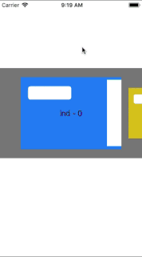
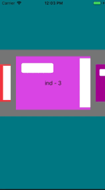

# WIZDynamicScroller

- create scroller with any view
- control takes place using swipe
- select start index
- long tap for select view
- drag&drop selected view for change positions
- drag&drop selected view on basket icon for delete it

 

HOW TO INSTALL

Import files from the folder "WIZDynamicScroller Obj-C" to your project. 

HOW TO USE

**Use delegate**

*-(NSInteger)countItemOfDynamicScroller:(WIZDynamicScroller\*)scroller;*

Number of views in the DynamicScroller

*-(UIView\*)dynamicScroller:(WIZDynamicScroller\*)scroller viewForItemAtIndex:(NSInteger)index;*

It must return object by index

*-(void)dynamicScroller:(WIZDynamicScroller\*)scroller didShowItemAtIndex:(NSInteger)index*

It return index a showed object

*-(void)dynamicScroller:(WIZDynamicScroller\*)scroller didMoveFromIndex:(NSInteger)fromIndex toIndex:(NSInteger)toIndex*

It return both indexes after moving a view

*-(void)dynamicScroller:(WIZDynamicScroller\*)scroller deleteItemArIndex:(NSInteger)index*

It return a deleted view's index 

**Use methods and properties**

- *currentViewsIndex* - property return an index of a showed view
- *setStartIndex* - method set a starting index
- *updateScroller* - method reload a WIZDynamicScroller
- *permanentDelete* - set YES, if you want to stay the delete icon as a button constantly
- *disable move* - call the method, if you want disable the moving functionality